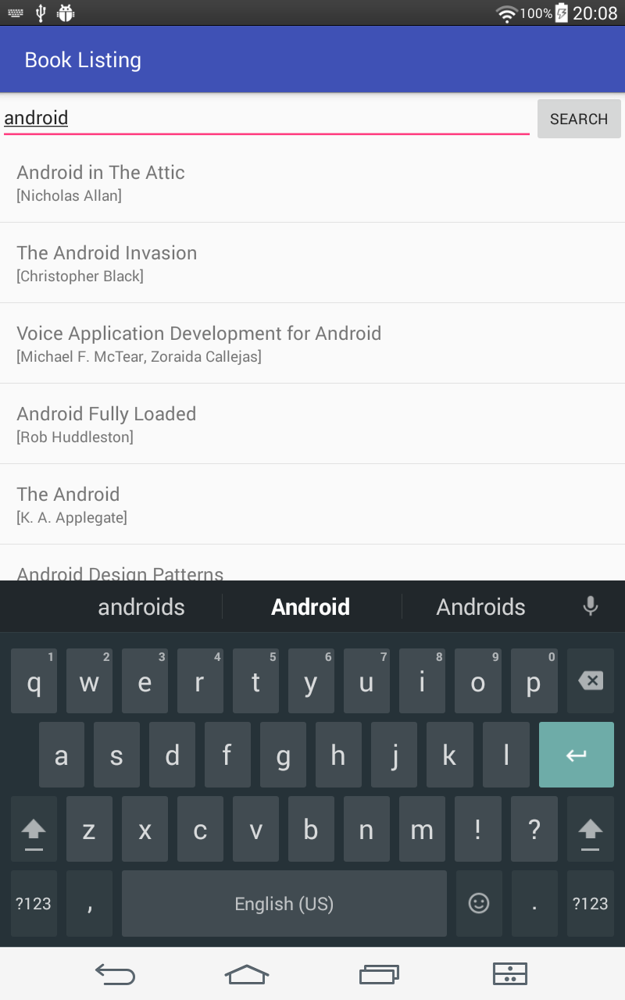
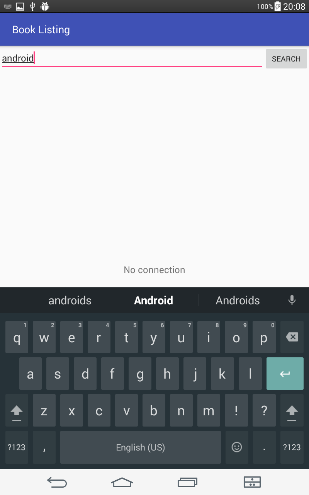

# Books Listing

Sixth task from Udacity's [Android basics course](https://www.udacity.com/course/android-basics-nanodegree-by-google--nd803)

Android Basics: Networking

[Lesson 4: Book Listing App](https://review.udacity.com/#!/rubrics/164/view)

This app fetches data from Google Books.

The user can enter a word or phrase to serve as a search query. 

The app fetches book data related to the query via an HTTP request from the [Google Books API](https://developers.google.com/books/docs/overview).

App contains a ListView which becomes populated with list items.

List items display authors and title information.

When there is no data to display, the app shows a default TextView that informs the user that na data was found.

or how to populate the list

The app checks whether the device is connected to the internet and responds appropriately.

The network call occurs off the UI thread using an AsyncTask.